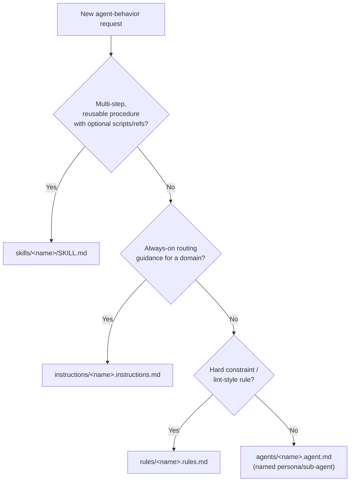

# AGENTS.md — GenSource.Template

Root instructions for any AI coding agent working in this repository. Most
agent tools (Claude Code, Codex, Cursor, Gemini CLI, GitHub Copilot, and
others) read this file automatically at session start.

## What this project is

`GenSource.Template` is a **Tauri v2 desktop app template**: React +
TypeScript frontend, Rust backend, packaged for Windows via NSIS. As a
template, every tracked file is currently an empty placeholder — the value
of this repo right now is its **structure and conventions**, not its
contents. When you fill in a placeholder file, keep the layout described
below.

## Tech stack & layout

- **Frontend** — `src/app/` (`App.tsx`, `main.tsx`, `pages/`, `styles/`,
  `types/`), built with Vite + React + TypeScript.
- **Config centralization** — all tooling config lives under `src/configs/`
  instead of the repo root: `vite.config.ts`, `vitest.config.ts`,
  `playwright.config.ts`, `eslint.config.js`, `knip.ts`, `middleware.ts`, and
  a `tsconfig.*.json` split by purpose (`base`/`app`/`build`/`e2e`/`node`/
  `test`). The root `tsconfig.json` references these.
- **Backend** — `src-tauri/src/` (`lib.rs`, `main.rs`, `commands/commands.rs`,
  `state/state.rs`, `mdoels/models.rs` — note the `mdoels` directory name is
  a pre-existing typo in this template; preserve it unless asked to rename,
  since renaming affects `mod` paths across the crate). Tauri v2 permissions
  live in `src-tauri/capabilities/{default,desktop}.json`.
- **Packaging** — Windows-first, via `src-tauri/nsis/installer.nsh` and
  `other/utilities/7zr.exe`.
- **Tooling** — npm (`.node-version`, `.npmrc`), `commitlint`, `release-it`,
  `prettier`, `knip` (dead-code detection).
- **Environments** — `.env`, `.env.dev`, `.env.local`, `.env.prod`,
  `.env.example`.
- **Editor/agent configs already coexist**: `.vscode/`, `.cursor/`,
  `.agents/` (this folder).

Full details, kept up to date as the template gains real content, live in
[`.agents/skills/create-skill-pro/references/project-context.md`](skills/create-skill-pro/references/project-context.md).

## The `.agents/` folder

This project reserves the following top-level folders under `.agents/` so
every kind of reusable agent context has one, well-known home. Look here
before creating new context from scratch, and prefer adding to the matching
folder over inventing a new location.

| Folder | Purpose | Example file |
|---|---|---|
| [`agents/`](agents/) | Named sub-agent personas invoked as delegates | `<name>.agent.md` |
| [`assets/`](assets/) | Shared static assets/templates available to all agents/skills | boilerplate snippets, icons |
| [`commands/`](commands/) | Reusable custom slash-command definitions | `<name>.command.md` |
| [`core/`](core/) | Foundational/shared config & context loaded by most other primitives | `conventions.md` |
| [`data/`](data/) | Structured datasets agents/skills may read | `*.json` / `*.csv` |
| [`documents/`](documents/) | Longer-form project docs, specs, ADRs | `architecture.md` |
| [`instructions/`](instructions/) | Standing, always-relevant routing guidance for a domain | `<name>.instructions.md` |
| [`logs/`](logs/) | Run/audit logs written by agents or skills during execution | `*.log` |
| [`mcp/`](mcp/) | MCP server configs/definitions available to agents | `*.json` |
| [`memory/`](memory/) | Persistent cross-session facts/context agents can read & append | `*.md` |
| [`personas/`](personas/) | Tone/voice/expertise persona definitions reusable across agents/skills | `*.md` |
| [`plans/`](plans/) | Saved/templated plans for recurring work | `*.md` |
| [`plugins/`](plugins/) | Bundled multi-capability extension packages | `<name>/` |
| [`prompts/`](prompts/) | Reusable standalone prompt snippets/templates | `*.md` |
| [`rules/`](rules/) | Hard constraints / lint-style rules that must not be violated | `<name>.rules.md` |
| [`scripts/`](scripts/) | Shared executable helpers usable by any agent/skill | `*.mjs` |
| [`skills/`](skills/) | Portable, on-demand skill packages | `<name>/SKILL.md` |
| [`workflows/`](workflows/) | Multi-step/multi-agent orchestration definitions | `*.md` |

### Which one do I create?

Data/context (memory, personas, prompts, data, documents, workflows, plans,
commands, mcp, core, logs, assets) goes directly in its matching folder
above. For new **behavior**, pick between the four behavioral primitives:

### Creating a new skill

Use the [`create-skill-pro`](skills/create-skill-pro/SKILL.md) skill. It
scaffolds a spec-compliant `SKILL.md` under `.agents/skills/<name>/`, checks
the other top-level folders above for material worth wiring in, and tailors
the result to this repo's actual stack and conventions.
