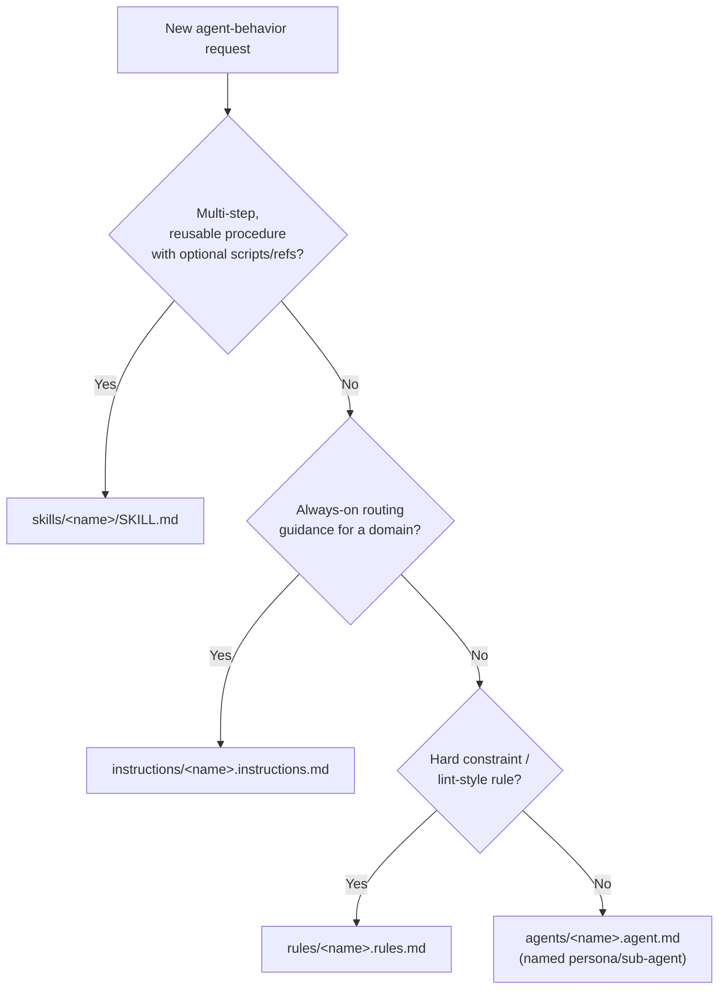

# create-skill-pro

Creates skills that are spec-compliant, appropriately sized, and genuinely
tailored to this repo — not generic boilerplate.

## Workflow

1. **Clarify scope.** Confirm the skill's name (lowercase-hyphenated,
   ≤64 chars), what it does, and when it should trigger. If ambiguous, ask
   before scaffolding.
2. **Check for overlap.** Look in `.agents/skills/` for an existing skill
   covering this; look in `.agents/instructions/`, `.agents/rules/`,
   `.agents/agents/` for whether this is really a different primitive (see
   [decision guide](#which-agents-primitive) below).
3. **Scan the rest of `.agents/` for material to wire in.** Before writing
   from scratch, check whether any of these already hold something the new
   skill should reference, read, or write to:
   - `memory/` — relevant facts/decisions already recorded
   - `personas/` — a tone/persona the skill should adopt
   - `prompts/` — a prompt template the skill can reuse
   - `data/` — a dataset the skill's instructions should read
   - `documents/` — specs/ADRs that justify or constrain the approach
   - `workflows/` / `plans/` — a larger process this skill is one step of
   - `commands/` — a related slash command
   - `mcp/` — an MCP server the skill should call
   - `core/` — shared conventions to stay consistent with
   - `logs/` — whether the new skill should write execution logs here
   - `assets/` (top-level) — shared templates to reuse instead of duplicating

   If nothing relevant exists in a folder, skip it — don't force a
   reference that adds no value.
4. **Scaffold.** Either run:

   ```bash
   node .agents/skills/create-skill-pro/scripts/new-skill.mjs <name> \
     --description "What it does. Use when ..." --title "Title Case Name"
   ```

   or copy [`assets/skill-template.md`](assets/skill-template.md) by hand
   to `.agents/skills/<name>/SKILL.md`.
5. **Write the body.** Keep it under ~500 lines / ~5000 tokens (see
   [progressive disclosure](references/agentskills-spec.md#progressive-disclosure-why-body-length-matters)).
   Ground every file path/convention in
   [`references/project-context.md`](references/project-context.md) — never
   invent project facts. See
   [`examples/tauri-command-skill/`](examples/tauri-command-skill/SKILL.md)
   for what a good, concise, project-tailored skill body looks like.
6. **Add per-skill subfolders only where they earn their keep** (see
   [subfolder purposes](#per-skill-subfolder-purposes) below). It's fine —
   good, even — for a small skill to have only a `SKILL.md` and nothing else.
7. **Self-review and validate.**

   ```bash
   node .agents/skills/create-skill-pro/scripts/validate-skill.mjs .agents/skills/<name>/SKILL.md
   ```

   Also walk [`resources/quality-checklist.md`](resources/quality-checklist.md)
   before considering the skill done.

## Frontmatter quick reference

| Field | Required | Notes |
|---|---|---|
| `name` | Yes | Must match the parent directory name. |
| `description` | Yes | States what + when; include trigger keywords. |
| `license`, `compatibility`, `metadata`, `allowed-tools` | No | See [full spec reference](references/agentskills-spec.md). |

`version` goes in `metadata.version`, not top-level. Full constraints and
the directory-discovery/collision rules live in
[`references/agentskills-spec.md`](references/agentskills-spec.md).

## Per-skill subfolder purposes

Each of the five optional subfolders a skill can have does one distinct job
— use whichever apply, skip the rest:

| Folder | Use for |
|---|---|
| `scripts/` | Executable helpers (validation, scaffolding, codegen). |
| `references/` | Long-form docs loaded on demand (specs, deep dives). |
| `assets/` | Copyable output material (templates/boilerplate). |
| `examples/` | Worked calibration material (sample input/output, sample skills). |
| `resources/` | Curated, non-copyable support material (checklists, external links). |

## Which `.agents/` primitive?

Not every request is a skill. See the root
[`AGENTS.md`](../../AGENTS.md#which-one-do-i-create) for the full folder map
and this decision guide:



If the request is really about `memory/`, `personas/`, `prompts/`, `data/`,
`documents/`, `workflows/`, `plans/`, `commands/`, `mcp/`, `core/`, `logs/`,
or top-level `assets/` content, put it directly in that folder instead of
wrapping it in a skill.

## After creation

A created skill isn't limited to its own subfolders — it can read or write
any top-level `.agents/` folder it needs at runtime (e.g. append a decision
to `memory/`, write a run record to `logs/`, read a dataset from `data/`).
Document that access in the skill's own body so it's not a surprise.

## Auditing an existing skill

Run `scripts/validate-skill.mjs` against it, then walk
`resources/quality-checklist.md`. Common fixes: body too long (move detail
to `references/`), stale project references (cross-check against
`references/project-context.md`, which is kept current as this template's
placeholders get filled in), or unused empty subfolders left over from
scaffolding.
