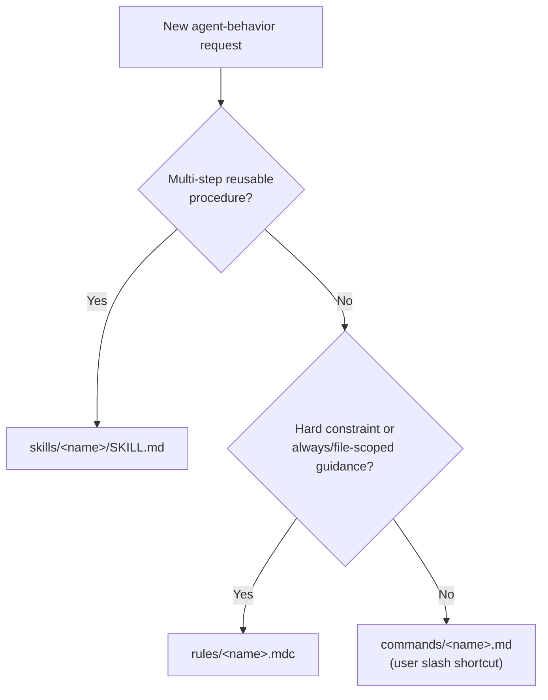

# AGENTS.md — GenSource.Template

Root instructions for any AI coding agent working in this repository.
Cursor loads this file (and project rules/skills/commands) at session start.

## What this project is

`GenSource.Template` is a **Tauri v2 desktop app template**: React +
TypeScript frontend, Rust backend, packaged for Windows via NSIS. As a
template, every tracked app file is currently an empty placeholder — the
value of this repo right now is its **structure and conventions**, not its
contents. When you fill in a placeholder file, keep the layout described
below.

## Tech stack & layout

- **Frontend** — `src/app/` (`App.tsx`, `main.tsx`, `pages/`, `styles/`,
  `types/`), built with Vite + React + TypeScript.
- **Config centralization** — all tooling config lives under `src/configs/`
  instead of the repo root: `vite.config.ts`, `vitest.config.ts`,
  `playwright.config.ts`, `eslint.config.js`, `knip.ts`, `middleware.ts`, and
  a `tsconfig.*.json` split by purpose (`base`/`app`/`build`/`e2e`/`node`/
  `test`). The root `tsconfig.json` references these.
- **Backend** — `src-tauri/src/` (`lib.rs`, `main.rs`, `commands/commands.rs`,
  `state/state.rs`, `mdoels/models.rs` — note the `mdoels` directory name is
  a pre-existing typo in this template; preserve it unless asked to rename,
  since renaming affects `mod` paths across the crate). Tauri v2 permissions
  live in `src-tauri/capabilities/{default,desktop}.json`.
- **Packaging** — Windows-first, via `src-tauri/nsis/installer.nsh` and
  `other/utilities/7zr.exe`.
- **Tooling** — npm (`.node-version`, `.npmrc`), `commitlint`, `release-it`,
  `prettier`, `knip` (dead-code detection).
- **Environments** — `.env`, `.env.dev`, `.env.local`, `.env.prod`,
  `.env.example` (names only in `.env.example`; never real secrets).

Full path details for skills live in
[`skills/create-skill-pro/references/project-context.md`](skills/create-skill-pro/references/project-context.md).

## The `.cursor/` folder (Cursor-native only)

This project uses **only** Cursor-native agent surfaces under `.cursor/`.
Do not invent extra top-level agent folders (no personas, memory, workflows,
custom `.rules.md` / `.command.md` / `.agent.md` trees).

| Path | Purpose |
|---|---|
| [`rules/`](rules/) | Project rules as `*.mdc` (`alwaysApply` / `globs`) |
| [`skills/`](skills/) | On-demand Agent Skills (`<name>/SKILL.md`) |
| [`commands/`](commands/) | Slash commands as `*.md` |
| [`hooks.json`](hooks.json) + [`hooks/`](hooks/) | Project hooks (Node `.mjs`) |
| [`mcp.json`](mcp.json) | Project MCP server config |

Also at the repo root: [`.cursorignore`](../.cursorignore) (indexing ignore).

### Which primitive do I create?

### Creating a new skill

Use [`create-skill-pro`](skills/create-skill-pro/SKILL.md). It scaffolds a
spec-compliant `SKILL.md` under `.cursor/skills/<name>/` and grounds paths in
this repo's real layout.

### MCP

[`mcp.json`](mcp.json) starts with an empty `mcpServers` object so clones are
not forced onto unauthenticated servers. To add Context7 (library docs) or
other servers, edit `mcp.json` using Cursor's current project MCP schema
(Settings → MCP), then commit the working config if the team should share it.
